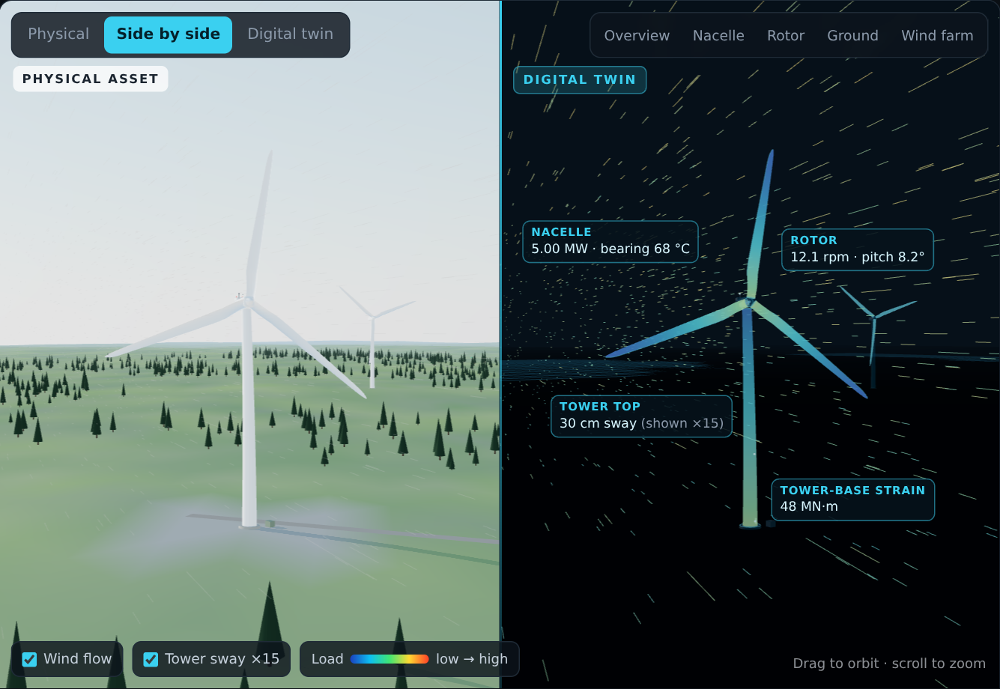
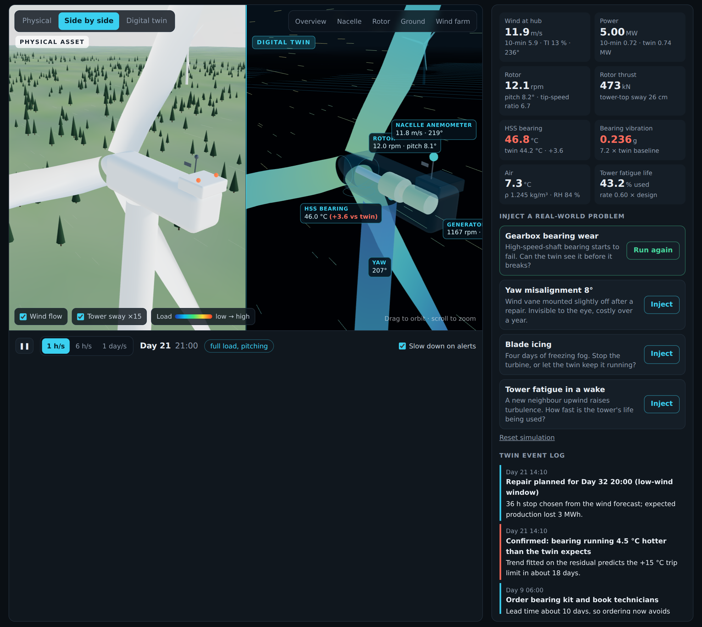
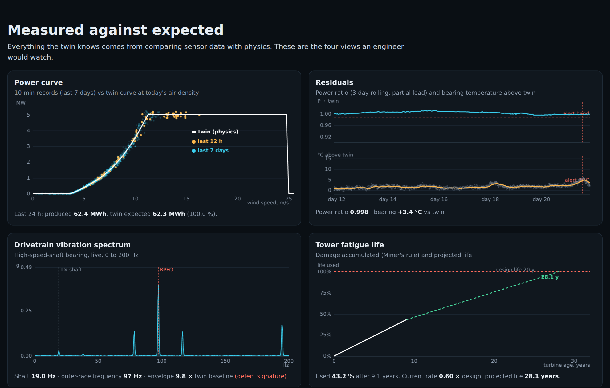
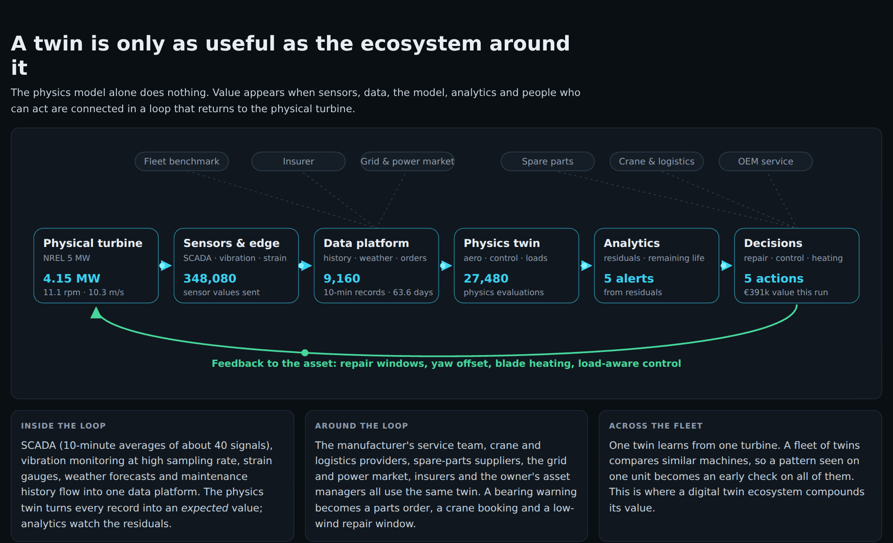

# Wind Turbine Digital Twin

**Live page:** https://rajan56.github.io/turbine-digital-twin/

A physics-based digital twin of the **NREL 5 MW reference wind turbine**, running entirely in the browser. A 126 m rotor turns in turbulent wind next to its virtual copy. The twin computes, from physics, what the turbine *should* be doing, and the gap between expected and measured behaviour is where the value lies:

- a failing gearbox bearing found weeks before it breaks
- energy lost to a misaligned nacelle
- an iced rotor kept producing instead of stopped
- a tower whose fatigue life is stretched by smarter control



> **The turbine and its data are simulated.** Parameters come from a real, published reference turbine (Jonkman et al., 2009). Costs, failure rates and icing days in the value calculator are illustrative assumptions for a Nordic onshore fleet.

## What you can do on the page

| | |
|---|---|
| **See the asset and its twin** | The physical turbine (left) and the digital twin (right) share one model. The twin view shows blade and tower loads as a colour map, the drivetrain inside the nacelle, sensor readings, and wind streaks that slow down in the rotor wake. |
| **Inject real-world problems** | Four scenarios, each detected from residuals between measured data and the physics model. |
| **Watch the evidence** | Power curve, residuals, a live vibration spectrum and tower fatigue life, updated as simulated days pass. |
| **Price the ecosystem** | A value calculator uses the results of your runs, plus assumptions you can change, to estimate fleet value against the cost of the twin ecosystem. |

## The four scenarios (results from a reference run)

| Scenario | How the twin detects it | Result |
|---|---|---|
| **Gearbox bearing wear** | Outer-race defect frequency (BPFO) in the vibration envelope, then the bearing-temperature residual; an exponential trend gives remaining life; the repair goes into the lowest-wind window of the forecast | Early warning **25 days** before the failure would have happened, confirmed 16 days before; about 2 MWh lost in a planned stop instead of about 1,400 MWh and a gearbox exchange |
| **Yaw misalignment (8°)** | 3-day rolling ratio of measured to expected power in partial load; a deficit with a 5-sigma margin is converted to an angle with the cos² law | Detected in **3 days**, estimated at **8.2°**, corrected remotely |
| **Blade icing** | Power residual below 85 % at sub-zero temperature and high humidity | Blade heating instead of an ice stop: about **337 MWh** produced during a 4.5-day cold spell against about 60 MWh with a standard ice detector |
| **Tower fatigue in a wake** | Tower-base damage-equivalent load from thrust variance under turbulence, Miner's rule, calibrated to a 20-year design life | Load-aware control in the wake sector adds about **1 year** of projected tower life for about 1.7 % less energy |





## Physics

| Quantity | Model | NREL 5 MW value | This model |
|---|---|---|---|
| Rated power, wind, rotor speed | Optimal-torque control below rated; gain-scheduled PI pitch control above rated (NREL baseline gains, 8°/s limit) | 5 MW at 11.4 m/s, 12.1 rpm | 5 MW at 11.4 m/s, 12.1 rpm |
| Peak power coefficient | Heier's C<sub>p</sub>(λ, β) surface scaled to the rotor optimum | 0.482 at λ 7.55 | 0.482 at λ 7.55 |
| Blade pitch at 12 / 15 / 25 m/s | Pitch mapped to reproduce the NREL schedule | 3.83° / 10.45° / 23.47° | 3.83° / 10.45° / 23.47° |
| Thrust at rated | Momentum theory from C<sub>p</sub> with a constant loss factor | about 800 kN | 782 kN |
| Tower | First fore-aft mode, 1 % damping, aerodynamic damping from relative wind | 0.324 Hz | 0.324 Hz, about 0.44 m top deflection at rated |
| Wind | Ornstein-Uhlenbeck turbulence with the IEC Kaimal length scale (340 m); Weibull 10-minute means (k 2.1, mean 7.5 m/s) | | Annual energy about 16 GWh (capacity factor 37 %) |
| Wake (visual) | Jensen top-hat wake, induction upstream of the rotor | | |
| Blade geometry | Lofted from the published chord and twist at 17 stations, 2.5° precone, 5° shaft tilt | | |

## Code

```
index.html            the published page (single file, built from app/)
app/
  index.html          page structure
  src/physics.js      turbine physics: aerodynamics, control, rotor and tower dynamics, energy yield
  src/twin.js         the digital twin: 10-minute SCADA records, faults, residual detectors, actions, value
  src/scene.js        three.js scene: lofted NREL blades, tower bending, terrain, forest, wind wake, twin overlays
  src/charts.js       canvas charts and FFT
  src/main.js         page logic: timeline, scenarios, readouts, ecosystem diagram, value calculator
  src/style.css
docs/img/             screenshots
```

Run it locally:

```bash
cd app
npm install
npm run dev          # development server
npm run build        # writes dist/index.html (copy it to the repository root to publish)
```

## Where it came from

This version grew out of an earlier Figma Make prototype that sketched the digital twin ecosystem as layers: physical turbine, IoT gateway, connectivity, cloud platform, digital twin, AI analytics, control dashboard and feedback loop. That layered idea is kept in the *Ecosystem* section of the page. Everything else is rebuilt: a 3D model with real geometry, a physics model instead of fixed animations, and scenarios that produce measurable results.



## References

Burton, T., Jenkins, N., Sharpe, D., & Bossanyi, E. (2011). *Wind energy handbook* (2nd ed.). Wiley.

Grieves, M., & Vickers, J. (2017). Digital twin: Mitigating unpredictable, undesirable emergent behavior in complex systems. In F.-J. Kahlen, S. Flumerfelt, & A. Alves (Eds.), *Transdisciplinary perspectives on complex systems* (pp. 85–113). Springer.

Heier, S. (2014). *Grid integration of wind energy* (3rd ed.). Wiley.

Jonkman, J., Butterfield, S., Musial, W., & Scott, G. (2009). *Definition of a 5-MW reference wind turbine for offshore system development* (NREL/TP-500-38060). National Renewable Energy Laboratory.

## Author

Rajan Kumar V K, D.Sc. (Tech.) in Industrial Engineering and Management (LUT University). Doctoral research on performance management with digital twins, AI and IoT in industrial companies. [LinkedIn](https://www.linkedin.com/in/rajan-kumar-v-k-0a541799/) · [Margin Recovery Case](https://rajan56.github.io/margin-recovery-case/)
